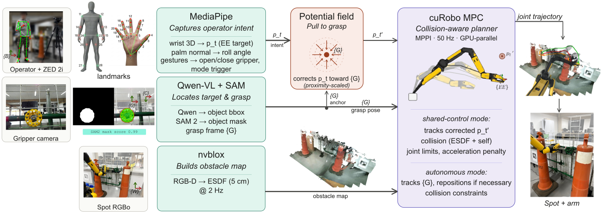

# From Perception to Assistance: Open-Vocabulary Shared Autonomy for Robotic Manipulation

Code release for the paper *"From Perception to Assistance: Open-Vocabulary Shared Autonomy for Robotic Manipulation"*.

The stack implements vision-based shared-control teleoperation of a quadruped mobile manipulator (Boston Dynamics Spot with the 6-DoF Spot Arm). A calibration-free camera interface decodes operator intent, an open-vocabulary perception pipeline grounds a free-form text prompt into a 3D grasp frame, and a GPU-accelerated model-predictive controller tracks the (potential-field assisted) reference under self- and environment-collision constraints built from onboard volumetric mapping. An autonomous mode can be gesture-triggered to complete the grasp on the same grounded target.

## Video

[](https://www.youtube.com/watch?v=UNAeSZh0kCU)

*Click the thumbnail to watch the full demonstration, including the industrial valve manipulation and pick-and-place tasks, the collision avoidance stress test, and autonomous execution.*

## Framework overview



The operator is tracked with a ZED 2i RGB-D camera and MediaPipe, with no wearables, fiducials, or calibration stage. Wrist motion maps to an end-effector position reference, the palm normal sets the gripper roll, and hand gestures command the gripper and mode switches. The target is specified with a free-form text prompt ("wheel valve"), grounded by Qwen3-VL in the gripper camera, and tracked across the three onboard cameras with SAM 2 streaming predictors, producing a world-latched grasp frame that is kept out of the static obstacle map. nvblox fuses the onboard stereo depth into a TSDF/ESDF, and cuRobo runs MPPI-based MPC at 50 Hz against that map for self- and environment-collision avoidance. During the final approach, an attractive potential field corrects the operator's reference toward the grasp frame while the operator retains authority. The same grasp frame drives the gesture-triggered autonomous mode.

## Repository layout and paper-section map

| Paper section | Component | Location |
|---|---|---|
| II-A Vision-based teleoperation | Body/wrist tracking, body frame estimation, workspace scaling | `spot-ros2_ws/src/arm_pose_estimator/arm_pose_estimator/wrist_detector.py` |
| II-A Hand pose and gestures | Palm-normal roll, gesture commands (MediaPipe) | `arm_pose_estimator/hand_pose_estimator.py`, `hand_orientation_estimator.py` |
| II-B Volumetric mapping | nvblox TSDF/ESDF configuration and launch, dynamic-mask integration | `isaac-ros_ws/src/spot_nvblox/` |
| II-C Open-vocabulary grounding | VLM grounding service (Qwen3-VL via vLLM), affordance-point selection | `spot_operation_ros2/vlm_relocalize_node.py` |
| II-C Multi-camera segmentation | SAM 2 streaming predictors (hand + two body cameras), seeding, lifecycle | `spot_operation_ros2/sam2_tracker_node.py`, `tf_projection_node.py`, `coordinator_node.py`, `image_roll.py` |
| II-D Collision-aware MPC | cuRobo MPPI MPC node, ESDF interface, collision spheres | `spot_operation_ros2/curobo_mpc_node.py`, `config/` |
| II-E Potential-field assistance | Attractive field toward the grasp frame (inside the MPC node goal update) | `spot_operation_ros2/curobo_mpc_node.py` |
| II-F Autonomous execution | Gesture-triggered mode switch; the MPC tracks the grasp frame directly; gripper control | `spot_operation_ros2/curobo_mpc_node.py`, `control_mode_switcher.py`, `gripper_controller.py` |

`fake_wrist_target.py` publishes a synthetic operator reference for bench tests without the camera interface. `isaac_publisher.py`, `joint_state_mapper.py`, and `joint_state_remapper.py` bridge joint topics for simulation runs.

## Hardware and compute

The experiments in the paper use:

- Boston Dynamics Spot with the 6-DoF Spot Arm and gripper camera
- ZED 2i RGB-D camera facing the operator
- A single NVIDIA GPU running the full onboard-facing stack (nvblox mapping, cuRobo MPC, SAM 2 trackers) plus the vLLM server for Qwen3-VL-4B-Instruct

The teleoperation interface itself is robot-agnostic: it publishes a Cartesian end-effector reference, a roll command, and discrete gripper actions, and can be adapted to any RGB-D sensor with aligned depth and known intrinsics.

## Building

Third-party ROS dependencies are pinned as git submodules. Clone recursively:

```bash
git clone --recursive <this-repo-url>
# or, in an existing checkout:
git submodule update --init --recursive
```

The Spot robot description package (`spot_description`, providing the URDF/xacro
consumed by `curobo_mpc.launch.py`) is not included here; place a Spot
description package at `spot-ros2_ws/src/spot_description` before building the
`spot-ros2` workspace.

## Running

The stack is containerized; services are defined in `docker-compose.yaml`:

- `spot-ros2` — ROS 2 Humble workspace (perception, control, teleop interface)
- `zed` — ZED 2i camera driver for the operator-facing camera
- `isaac-ros` — nvblox volumetric mapping
- `vllm-server` — Qwen3-VL-4B-Instruct served over an OpenAI-compatible API

Typical bring-up on the robot:

```bash
docker compose up -d vllm-server zed spot-ros2 isaac-ros
# inside spot-ros2 (after colcon build --symlink-install):
ros2 launch arm_pose_estimator wrist_detector_zed.launch.py       # operator interface
ros2 launch spot_operation_ros2 perception_minimal.launch.py \
     object_prompt:="wheel valve"                                  # grounding + tracking
ros2 launch spot_operation_ros2 curobo_mpc.launch.py               # collision-aware MPC
# inside isaac-ros:
ros2 launch spot_nvblox spot_nvblox.launch.py                      # TSDF/ESDF mapping
```

The MPC node is executed with a dedicated virtual environment (`spot-ros2_ws/curobo_venv`, referenced by `curobo_mpc.launch.py`) in which cuRobo and its PyTorch dependencies are installed inside the `spot-ros2` container, following the upstream cuRobo installation instructions.

## Dependencies (pinned)

All ROS dependencies below are pinned as git submodules at the exact commits
used in the experiments (see `.gitmodules`).

| Dependency | Pinned commit | Notes |
|---|---|---|
| [cuRobo](https://github.com/NVlabs/curobo) | `ebb7170` (v0.7.7+5) | MPPI MPC, ESDF collision checking |
| [isaac_ros_nvblox](https://github.com/NVIDIA-ISAAC-ROS/isaac_ros_nvblox) | `7908a18` (v3.2 line) | TSDF/ESDF mapping |
| [isaac_ros_common](https://github.com/NVIDIA-ISAAC-ROS/isaac_ros_common) | `fcf4d9e` (v3.2 line) | build/runtime support |
| [spot_ros2](https://github.com/bdaiinstitute/spot_ros2) | `4143c50` (spot-sdk-4.0.0+) | robot driver |
| [zed-ros2-wrapper](https://github.com/stereolabs/zed-ros2-wrapper) | `e9f5490` (humble-v4.2.5 line) | operator camera |
| [zed-ros2-interfaces](https://github.com/stereolabs/zed-ros2-interfaces) | `cfffb88` (5.0.1+) | ZED message definitions |
| Qwen3-VL-4B-Instruct | via vLLM (see `docker-compose.yaml`) | open-vocabulary grounding |
| SAM 2.1 (base) | via `ultralytics` | promptable video segmentation |
| MediaPipe Pose / Hands / Gestures | `mediapipe` | operator tracking |

The VLM, SAM 2, and MediaPipe models are pulled at build time by the Docker
images and the Python requirements, not vendored here.

## Citation

If you use this code in your research, please cite the paper:

```bibtex
@article{openvocab_shared_autonomy_2026,
  title   = {From Perception to Assistance: Open-Vocabulary Shared Autonomy for Robotic Manipulation},
  author  = {},
  journal = {arXiv preprint},
  year    = {2026},
  note    = {Submitted to IEEE Robotics and Automation Letters}
}
```

